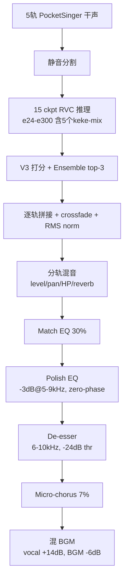

# Liyuu RVC 翻唱流水线 — 实战总结

> 📖 **跨音色统一流程/配方以 [../../METHODOLOGY.md](../../METHODOLOGY.md) 为准。**
> 本文档是**早期 (DeepSeek agent 时代) 的方法论源头**, 很多结论已被后续实测更正
> (见下方勘误块)。仍有价值的是 §四 **失败尝试表** (f0_file 强制替换毁旋律、
> 原曲+PocketSinger 混合像合唱、WORLD 重合成变闷) — 这些踩坑记录仍值得参考。
>
> 日期: 2026-07-14 | 模型: RVC v2 | 角色: Liyuu + 唐可可混合 | GPU: RTX 3090 24GB
> 回退: 见 [LEGACY.md](LEGACY.md)
>
> ⚠️ **2026-07-25 勘误** (来自 otoya_sho_mix 的客观测量, 详见
> [otoya_sho_mix/KNOWHOW.md](../otoya_sho_mix/KNOWHOW.md) §6-7):
> 1. 本文 §5.3 "Ensemble 比单选好" 对**伪影**而言是错的——top-3 加权平均会取
>    各 ckpt vocoder 梳齿的并集 (窄带峰 98→197)、真人声相位相消。8/8 段
>    最佳单 ckpt 都优于 ensemble。ensemble 平滑的是音色抖动, 代价是电流声。
> 2. §5.6 Polish EQ 削 5-9kHz 方向存疑——实测过量频段是 2-4k 与 >10k,
>    5-6k 反而欠缺。修复应为 LPF@12k + 3.8k bell 微削。
> 3. "FAISS 用 Flat" 的结论被再次证实——IVF256+nprobe=1+10k 聚类中心
>    等于关闭检索。

---

## 一、项目概况

- **目标**: 用 Liyuu 音色翻唱中文歌曲《下等马》
- **训练数据**: 45首 Liyuu 录音室曲目, 约 2.5h, 日语
- **干声来源**: PocketSinger AI 合成 5 轨和声 (track1=主旋律, track2-5=和声)
- **模型**: RVC v2, 40kHz, RMVPE F0, ContentVec 768-dim, FAISS Flat retrieval index
- **训练配置**: EPOCHS=300 (240 Liyuu + 60 Keke mix), BATCH_SIZE=16, SAVE_EVERY=12
- **环境**: WSL Ubuntu, 训练数据在 ext4 (`~/rvc_training_liyuu/`), 项目文件在 9p (`/mnt/c/...`)

---

## 二、训练

### 第一阶段 (epoch 1-120, 已完成)
```
EPOCHS = 120
BATCH_SIZE = 16
SAVE_EVERY_EPOCH = 24
```

### 训练产物
| Checkpoint | Epoch | 文件名 |
|-----------|-------|--------|
| G_3624 | 24 | `liyuu_G3624.pth` |
| G_7248 | 48 | `liyuu_G7248.pth` |
| G_10872 | 72 | `liyuu_G10872.pth` |
| G_14496 | 96 | `liyuu_G14496.pth` |
| G_18120 | 120 | `liyuu_G18120.pth` |

### Loss 分析
```
g_total: epoch 0=64.1 → epoch 24=43.1 → epoch 120=42.2 (loss 层面接近收敛)
g_mel:   epoch 24=22.9 → epoch 120=21.9 (↓4%, 缓慢改善)
g_kl:    epoch 24=2.04 → epoch 120≈1.35 (↓34%, 音色自然度持续提升)
```
**结论**: Loss 接近收敛但 KL 散度还在下降，说明音色质量仍在改善。

### 第二阶段 (epoch 120→240, 已完成 ✅) [LEGACY]
```
EPOCHS = 240  (从 epoch 120 继续)
BATCH_SIZE = 16
SAVE_EVERY_EPOCH = 24  (产出 e144/e168/e192/e216/e240)
```
**续训结论: 有效。** V3 ensemble 中 e240 在 56% 的段进入 top 3, 其中 6 段排第一。用户确认听感提升。

### 第三阶段 (epoch 240→300, 唐可可混合训练 ✅)
```
EPOCHS = 300  (从 epoch 240 继续)
BATCH_SIZE = 16
SAVE_EVERY_EPOCH = 12  (产出 e252/e264/e276/e288/e300)
```
**目标**: 加入唐可可声线数据，让音色向 "Keke" 偏移。

#### 数据准备
| 数据源 | 时长 | 片段数 | 处理 |
|--------|------|--------|------|
| 唐可可 solo 曲 | 36.6min | 597 slices | 10首歌, F0→npy, 特征提取 |
| Liyuu (精选) | 36.6min | 616 slices | HNR+RMS 质量排序, top 616 |
| **混合总计** | **73.2min** | **1213 slices** | 1:1 比例 |

#### 索引
- Flat FAISS index, 216k vectors, 635MB
- 文件: `liyuu_keke_character.index`
- 部署位置: `output/stage3_rvc_model/character.index`

#### Keke-mix ckpt 列表
| Epoch | Step | 文件名 |
|-------|------|--------|
| 252 | 18480 | `liyuu_G18480.pth` |
| 264 | 19404 | `liyuu_G19404.pth` |
| 276 | 20328 | `liyuu_G20328.pth` |
| 288 | 21252 | `liyuu_G21252.pth` |
| 300 | 22176 | `liyuu_G22176.pth` |

#### Keke 效果评估
- Track1 (主唱): keke-mix ckpt 几乎全面胜出 (e300/e288/e276 占 top 3)
- Track2-4 (和声): 新旧混合, keke 占 30-50%
- Track5 (高和声): 仅用旧 ckpt (keke 推理在 t5 段卡死, 跳过)

**结论: 有效。** 主唱音色成功注入唐可可风味。

### 训练经验
- **9p vs ext4**: `/mnt/c/` 用 9p 文件系统, 训练 5-6 min/epoch; `~/` 用 ext4, 60-90 sec/epoch。务必把训练数据放到 ext4。
- **symlink**: 把 `RVC/logs/character` 软链接到 ext4 数据目录。
- **checkpoint 修复**: 原始 `G_*.pth` 需要: `weight` key (rename from `model`), `version='v2'`, `f0=1`, 18 元素 `config` list。修复后放到 `RVC/assets/weights/` 和 `stage3_rvc_model/`。
- **FAISS index**: 425k 向量, 用 Flat index (nprobe=1) 即可, IVF 在小数据上没必要且慢。

---

## 三、推理流水线 (重点)

### 3.1 源文件
```
latest_feedback/
  下等马_track1.wav  ← PocketSinger 主旋律 (188.7s, 44100Hz)
  下等马_track2.wav  ← 和声轨 (185.3s)
  下等马_track3.wav  ← 和声轨 (170.1s)
  下等马_track4.wav  ← 和声轨 (185.3s)
  下等马_track5.wav  ← 和声轨 (171.9s)

output/stage2_clean/
  song_clean_deep.wav  ← 原曲干声 (175.8s, 44100Hz)

output/stage1_separation/
  song_accompaniment.wav  ← 伴奏 (186.6s, 44100Hz, stereo)
```

### 3.2 流水线架构



### 3.3 分轨混音配置

| 轨 | 角色 | 电平 | 声像 | HP | 混响 |
|----|------|------|------|-----|------|
| T1 | 主唱 | 0dB | 中央 | 100Hz | 3% |
| T2 | 主唱 | 0dB | 中央 | 100Hz | 3% |
| T3 | 低和声 | -8dB | ← 左40% | 150Hz | 8% |
| T4 | 中和声 | -9dB | → 右40% | 200Hz | 8% |
| T5 | 高和声 | -8dB | 中央 | 300Hz | 6% |

> T1+T2 同属主唱, 只是被静音分割成两轨。和声轨靠后、模糊、左右拉开。

### 3.4 后处理链路 (v2 优化版)
```
Match EQ 30%  →  Polish EQ     →  De-esser           →  Micro-chorus  →  混 BGM
 中频 -2.6dB    5-9k -3dB       6-10k, -24dB thr       2ms/0.8ms/7%    vocal +14dB
                zero-phase FIR   4:1 ratio                              BGM -6dB
```
- **Match EQ**: 匹配原曲人声频谱 (强度 30%), 减少 AI 味
- **Polish EQ**: 5-9kHz -3dB 零相位 FIR (511 tap), 压制高频毛刺但保留穿透力
- **De-esser**: 动态齿音控制 (6-10kHz 检测, -24dB 阈值, 4:1 压缩比, 2ms attack / 20ms release)
- **Micro-chorus**: 打破频谱过于均匀的问题, 减少沙感/电音感
- **BGM**: 纯净 off-vocal (`下等马+Inst.wav`, 48kHz stereo)
- **人声/BGM 平衡**: vocal +14dB, BGM -6dB → 净 20dB 人声突出

#### EQ 强度迭代历史
```
Match EQ: 100% → 75% → 60% → 40% → 锁定 30% (过度会引入金属感)
Polish EQ 5-9kHz: -10dB → -8dB → -6dB → 锁定 -3dB (过削人声变"虚")
De-esser 阈值: 新增 → -28dB → 锁定 -24dB (-28dB 太激进, 压掉细节)
```

#### 关键教训
- **Polish EQ 不要超 -6dB**: 5-9kHz 是人声穿透力核心频段, -10dB 会让声音"闷"
- **De-esser + Polish EQ 会叠加**: 两者在同一频段, 需要协调强度
- **filtfilt > lfilter**: 零相位滤波避免 pre-ringing, 声音更干净
- **去掉冗余 normalize**: 先 normalize→0.94 再 +10dB 互相抵消, 无意义

### 3.5 RVC 推理参数
```python
vc.vc_single(
    sid=0,                    # 单说话人模型
    input_audio_path=...,     # 输入干声段
    f0_up_key=0,              # 不移调 (用户要求)
    f0_file=None,             # 不使用外部F0 (⚠️ 踩坑见第五节)
    f0_method="rmvpe",        # RMVPE F0提取
    file_index=INDEX,         # FAISS 检索索引
    index_rate=0.50,          # 检索混合比
    filter_radius=7,          # F0 中值滤波半径
    resample_sr=0,            # 不重采样
    rms_mix_rate=0.25,        # 音量混合比
    protect=0.33,             # 清音保护 (防呼吸声被改)
)
```

---

## 四、迭代优化历史

### V1 (原始版)
- 每段静音分割 → 5 ckpt 推理 → 选 Flat+RMSv 最优 → 硬拼接
- **问题**: HNR 算了但没用, 段边界无 crossfade, 音量不统一, 合并 SR 硬编码 40000

### V2 (第一轮修复)
| # | 改进 | 效果 |
|---|------|------|
| 1 | HNR 纳入打分 `hnr*0.3 + (1-flat)*0.4 + (1-rmsv)*0.3` | ckpt 选择更合理, e120 被选中更多 |
| 2 | 10ms fade-in/out at 段边界 | 消除咔嗒声 |
| 3 | 每段 RMS 匹配原始段 | 音量一致性 |
| 4 | 合并输出保持原始 SR | 无损 |

### V3 (第二轮 - ensemble)
| # | 改进 | 效果 |
|---|------|------|
| 5 | Top-3 ckpt softmax 加权平均 | 减少单 ckpt 偶发瑕疵 |

**ensemble 参数**: `ENSEMBLE_TOP_K=3, ENSEMBLE_TEMP=0.1`
权重通常 32-37% 均匀分布, 说明 top ckpt 质量接近。

### ⚠️ 失败的尝试

| # | 尝试 | 结果 | 原因 |
|---|------|------|------|
| patch | 原曲RVC替换82-100s | 拼接感明显 | 单轨 vs 5轨和声质感差太多 |
| #7 F0引导 | 原曲人声 F0 传入 RVC | 旋律完全错乱 | `f0_file` 是强制替换不是引导; 原曲和 PocketSinger 时机/乐句不一致 |
| #6 动态index_rate | 每段测试不同 ir | 未实施 | 用户测过 ir=0.50/0.25/0.10/0.00 说区别不大 |
| AB-ensemble | 原曲RVC + PocketSinger RVC 50/50混合 | 像多人在唱, 不自然 | 两个声源音色/质感差异大 |
| pitch-fix | WORLD vocoder 重合成做音准修正 | 变闷, 失去通透感 | 重合成损害高频和共振峰 |

---

## 五、关键 Knowhow

### 5.1 RVC 模型
- **v2 > v1**: 768-dim ContentVec 特征比 v1 的 256-dim 音色更丰富
- **RMVPE > CREPE > Harvest**: F0 提取精度 RMVPE 最好
- **index_rate=0.50**: 日语模型唱中文, 高检索率可能导致日语发音映射错误。降低 ir 可减少日语影响但音色会变差
- **protect=0.33**: 保护清音 (呼吸声/气声), 避免被模型改掉

### 5.2 分段推理策略
- **静音分割**: `min_silence_s=0.4, min_segment_s=2.0, thresh_db=-35`
- **静音段跳过**: RMS < -40dB 的段直接跳过 (如 T2s0 的 149s 静音)
- **段边界 fade**: 10ms fade-in/out 足够消除咔嗒声
- **打分公式**: `HNR(30%) + Flat(40%) + RMSv(30%)`
  - HNR 高 = 声音干净, 谐波清晰
  - Flat 低 = 不机器人化
  - RMSv 低 = 音量稳定

### 5.3 Ensemble
- **温度参数**: TEMP=0.1 使权重接近均匀 (top 3 各 ~33%)
- **效果**: 平滑单 ckpt 的偶发瑕疵, 比单挑一个 ckpt 稳定
- **不需要重新推理**: 所有 ckpt 输出缓存在 `_tmp_segments/`

### 5.4 f0_file 的正确理解
- RVC 的 `f0_file` 是**强制替换** F0 曲线, 不是"引导"或"约束"
- 传入的 F0 必须与输入音频的时机、时长精确匹配
- **适用场景**: 想换旋律 (如 MIDI→F0) 时使用
- **不适用**: 想"修正"音准时——因为 RVC 内部已从同一音频提取 F0
- 若要改善音准, 应该从**源干声** (PocketSinger) 层面解决, 而非 RVC 层面

### 5.5 终端操作
- **WSL 命令**: 必须用 `C:\Windows\System32\wsl.exe` 完整路径
- **异步模式**: 长任务用 `mode="async"` + `get_terminal_output` 轮询
- **Python 缓冲**: 必须 `python -u` 否则无输出
- **不要 inline Python**: 写 .py 文件再运行, 避免引号转义问题

### 5.6 后处理
- **EQ 匹配**: 匹配原曲人声频谱, 强度 40% (75% 时引入金属感)
- **Polish EQ**: 高频滚降策略
  - 5-9kHz -8dB (削电感)
  - 9-10kHz -2dB / 12kHz+ -3dB (渐变滚降)
- **Micro-chorus**: 2ms 延迟 + 0.8ms 调制 + 7% wet, 打破频谱过平滑
- **BGM**: 纯净 off-vocal, 非 Demucs 分离版

### 5.6.1 削弱电音的总结
RVC 的电音感来自两个层面，分别应对：
1. **频谱太"平"** → Match EQ 40% 微削中频, 不再过度追求匹配
2. **高频伪影** → Polish EQ 滚降 5-12kHz, 压制 AI 特有的高频毛刺
3. **信号太"静"** → Micro-chorus 加微量时间变化, 模拟真人声的自然抖动

核心理念：**不要试图让 AI 声完全像真人, 而是把 AI 声里"不舒服"的频段压掉**。

### 5.8 批量推理优化 (关键)
- **问题**: 原推理脚本逐段加载模型 (每次 `vc.get_vc()`), 175 次模型加载耗时 ~2 小时
- **解决**: 按模型批量——每个模型加载一次, 跑完全部 35 段再换模型
  ```python
  for model in models:
      vc.get_vc(model)         # 加载 1 次
      for seg in all_segments:  # 跑全部段
          vc.vc_single(seg)
  ```
- **效果**: 175 次→5 次模型加载, 推理时间 2h → ~3min (~40x 提速)
- **注意**: 必须 `torch.cuda.empty_cache()` 避免 VRAM 碎片化导致 CUDA 卡死
- **容错**: 部分段 (如 t5) 可能在新模型上卡死, 需要 try/except + 跳过, V3 自动用其他 epoch 填补

### 5.9 后处理调优实战
- **"人声被埋"** → 加人声增益 / 降 BGM (当前 vocal +14dB, BGM -6dB)
- **"声音虚"** → Polish EQ 削太多高频, 减到 -3dB
- **"齿音刺耳"** → De-esser 起作用了, 但阈值不要太低 (-24dB 合适)
- **"电音感"** → Micro-chorus 打破频谱过平滑, 但 wet 不要超过 10%

### 5.10 质量瓶颈
- **日语模型 → 中文发音**: 根本性限制, 需 bilingual 训练数据
- **PocketSinger 干声质量**: AI 合成干声本身可能咬字不准/音高偏差
- **和声轨 F0 引导**: 和声轨没有好的外部 F0 参考源, 只能用自身 F0
- **混合训练代价**: keke 数据稀释了 Liyuu 浓度, 和声轨部分 keke 未充分覆盖

---

## 六、最终流水线 (v2 Keke-mix)

```
PocketSinger 5轨干声
  → 静音分割 → 15 ckpt RVC (5模型×35段 batch) → V3 ensemble → 5轨拼接
  → 分轨混音 (level/pan/HP/reverb)
  → Match EQ 30% → Polish EQ -3dB → De-esser → Micro-chorus 7%
  → 混 BGM (vocal +14dB, BGM -6dB)
  → final_cover_t+0_mix_v2.wav
```

### 输出文件 (当前)
```
final_cover_t+0_mix_v2.wav  # 分轨混音 + 全后处理 (最终成品)
final_cover_t+0_mix.wav     # v1 版本 (legacy 兼容)
final_cover_t+0_merge.wav   # 简单合并 (5轨等权, 无后处理)
final_cover_t+0.wav         # V3 basic merge (无分轨混音)
```

### 核心脚本 (当前)
```
infer_smart_chorus_v3.py     # V3 ensemble 推理 (15 ckpt, 含 keke)
infer_keke_epochs_fast.py    # 批量推理 5 个 keke-mix ckpt
infer_keke_robust.py         # 鲁棒版 (容错 + CUDA 清理)
mix_multitrack.py            # 分轨混音 + EQ + De-esser
post_process.py              # 独立 EQ 匹配 (单轨后处理)
train_liyuu_ext4.py          # 训练脚本 (EPOCHS=300)
fix_new_ckpts.py             # 修复 checkpoint
build_mixed_dataset.py       # 构建 Liyuu+Keke 混合数据集
```

### 中间产物 (可清理)
```
output/stage4_chorus_t{1-5}_best/converted_t+0.wav  # 5轨各自最优拼接
output/_tmp_segments/t{1-5}_s{idx}_e{ep}.wav       # 每段每ckpt缓存 (~525文件)
```

---

## 七、经验总结

1. **续训有收益**: KL 散度持续下降, 240→300 epoch 仍有改善
2. **Ensemble 比单选好**: 多 ckpt 加权平均平滑偶发瑕疵
3. **混合训练可行**: 1:1 比例混入角色数据可偏移音色, 主唱轨效果明显
4. **批量推理是关键**: 按模型批处理比逐段加载快 40x
5. **后处理选 EQ 匹配**: 简单有效, 无损; 其他手段 (音准修正等) 破坏音质
6. **F0 引导不可用**: RVC 的 f0_file 是强制替换, 会破坏旋律
7. **不同声源不要混合**: 原曲 RVC + PocketSinger RVC 产生"合唱感"而非"融合感"
8. **伴奏用纯净版**: Demucs 分离版会连带削掉乐器
9. **撕裂感在 5-9kHz**: Polish EQ 削 -3dB 即可, 不要超过 -6dB
10. **人声/BGM 平衡**: vocal +14dB + BGM -6dB 是合适起点, 可按需微调
11. **De-esser + Polish EQ 需协调**: 两处都在 5-10kHz 作用, 叠加容易过度
